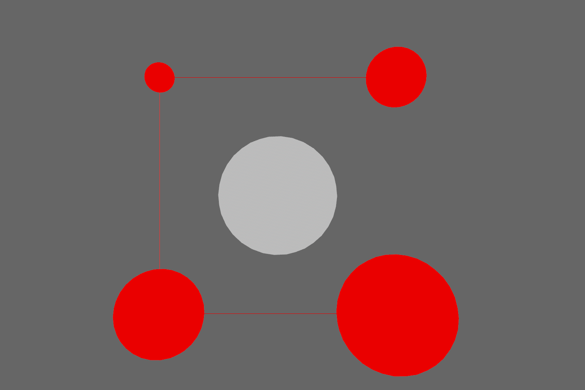

<div align="center">

# Visual Gizmos for Bevy

Visual gizmos to aid with development and debugging in [Bevy](https://bevyengine.org/)

[](https://github.com/bevyengine/bevy/blob/main/docs/plugins_guidelines.md#main-branch-tracking)
[](https://github.com/LiamGallagher737/bevy_mod_gizmos/actions)
[](https://github.com/LiamGallagher737/bevy_mod_gizmos)
[](https://crates.io/crates/bevy_mod_gizmos)
[](https://docs.rs/bevy_mod_gizmos)

</div>


# [Demo](examples/demo.rs)

This examples showcases all built-in gizmo types and interactions. Click on a gizmo and it will print to the console its name.

```
cargo run --example demo 
```

<!--  -->
<div align="center">
    
</div>


# Setup

Add the following to your `Cargo.toml`
```toml
bevy_mod_gizmos = "0.3.0"
```

Add this to any file you want to use gizmos in
```rs
use bevy_mod_gizmos::*;
```

Add the plugin to your app
```rs
.add_plugin(GizmosPlugin)
```

For interactive gizmos add the following bundle when spawning your camera
```rs
GizmoInteractionCamera::default()
```

To increase performance I recommend the following in your `Cargo.toml`
```toml
[profile.dev.package."*"]
opt-level = 3
```


# Usage

Draw a single gizmo
```rs
draw_gizmo(gizmo);
```

Draw multiple gizmos
```rs
draw_gizmos(vec![gizmo, gizmo, gizmo]);
```

Draw multiple gizmos and a connecting line
```rs
draw_gizmos_with_line(vec![gizmo, gizmo, gizmo]);
```

Draw a line
```rs
draw_line(points, color);
```

Draw a closed line
```rs
draw_closed_line(points, color);
```


# Interactions

```rs
Gizmo::new(translation, size, color).on_click(|| println!("Clicked!"))
Gizmo::new(translation, size, color).on_hover(|| println!("Hovered!"))
```


# Bevy Tracking

|Bevy|bevy_mod_gizmos|
|---|---|
|0.9|0.3.0|
|0.7|0.1.1|


# License

All code in this repository is dual-licensed under either:

* MIT License ([LICENSE-MIT](LICENSE-MIT) or [http://opensource.org/licenses/MIT](http://opensource.org/licenses/MIT))
* Apache License, Version 2.0 ([LICENSE-APACHE](LICENSE-APACHE) or [http://www.apache.org/licenses/LICENSE-2.0](http://www.apache.org/licenses/LICENSE-2.0))

at your option. This means you can select the license you prefer! This dual-licensing approach is the de-facto standard in the Rust ecosystem and there are [very good reasons](https://github.com/bevyengine/bevy/issues/2373) to include both.

Unless you explicitly state otherwise, any contribution intentionally submitted for inclusion in the work by you, as defined in the Apache-2.0 license, shall be dual licensed as above, without any additional terms or conditions.
